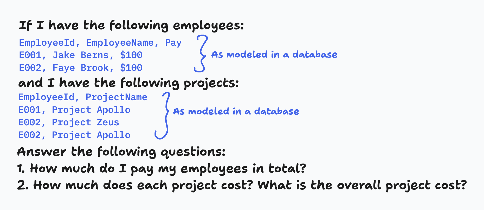

import { Image } from "astro:assets";
import aiTrapStrawberry from "./images/ai-data-traps/ai-trap-strawberry.png";
import aiTrap1 from "./images/ai-data-traps/ai-trap-1.png";
import aiTrap2 from "./images/ai-data-traps/ai-trap-2.png";
import aiTrap4 from "./images/ai-data-traps/ai-trap-4.png";

Last year, a simple AI prompt went viral: “How many R’s are there in the word
strawberry?” None of the AI models back then could get it right. You can even
see the result from the GPT-4 legacy model [here](https://chatgpt.com/share/67a50a2b-f2a4-8000-84be-71e37c532e09).

If AI struggles with something as straightforward as counting letters, you have
to wonder how it will handle more complex tasks like giving insights on your
data. When it comes to modeling data for your analytical layer, there are plenty
of traps that you might fall into and many of these traps aren’t immediately
obvious. In this post, I want to show how even the latest AI models can stumble
when faced with subtle data modeling traps. Chances are, some of these issues
are already lurking in your current setup.

## A Simple Example

Let’s start with an easy straightforward example and see how AI handles it.

Imagine we have a company with:
- **Two employees:** Jake Berns and Faye Brook, each earning $100 for their projects.
- **Two projects:** "Project Apollo" and "Project Zeus."

<Image
  src={aiTrap1}
  alt="A diagram showing Faye belonging to the two teams and Jake belonging to the one"
  width={300}
/>

In this scenario:
- Jake works solely on Project Apollo.
- Faye splits her time between Project Apollo and Project Zeus (since Project
  Zeus is a smaller project).

### Two Key Questions:
1. **How much do I pay my employees in total?**
2. **How much does each project cost? What is the overall project cost?**

**Answering Question 1:** \
It’s simple math: $100 + $100 equals $200 total.

**Answering Question 2:** \
Since Faye works on both projects, we should split her salary evenly. That means
$50 goes to each project. So:

<Image
  src={aiTrap2}
  alt="A diagram showing the money split correctly from Faye and Jake to the projects"
  width={300}
/>

- **Project Apollo:** Jake’s $100 + Faye’s $50 = $150
- **Project Zeus:** Faye’s $50 = $50
- **Overall project cost:** $150 + $50 = $200

## Testing AI with Our Example
Now, let’s use the same prompt for different AI models and see how they perform.
The prompt includes all the employee and project data as if you took it out your
database and included it in your prompt. You can see the prompt below:

For instance, when I tested OpenAI’s latest flagship model, o3-mini, it
surprisingly got the answer [wrong](https://chatgpt.com/share/67a51378-e10c-8000-a85e-91ac67686349)
by double-counting Faye’s salary instead of splitting it correctly:

<Image
  src={aiTrap4}
  alt="A diagram showing the money split incorrectly by double counting Faye and adding Jake to the projects"
  width={300}
/>

Next, I tried a model tuned for coding and logic, o3-mini-high. This one managed
to get it [correctly](https://chatgpt.com/share/67a513ce-f9c4-8000-bc67-64889dd12454).
It worked through the scenario, reasoning step by step just like we did. If you
expand the detailed reasoning, you’ll see comments like, “Mapping out how to
allocate employee salaries to projects to avoid double counting when they
contribute to multiple projects. Wondering if each employee's salary should be
evenly divided among all projects.” which ultimately led to the correct answer.

Here’s a quick rundown of other models tested:
- **OpenAI 4o:** [Correct](https://chatgpt.com/share/67a51418-a250-8000-b983-c6865f796422)
- **OpenAI o1:** Correct
- **Anthropic Claude 3.5 Sonnet:** Failed
- **Deepseek:** Failed
- **Deepseek with Deepthink (R1):** Correct
- **Google Gemini 2.0 Flash:** Failed
- **Google Gemini 2.0 Flash Thinking Experimental:** Failed

Only 4 out of 9 models got the answer right. Surprised? You shouldn’t be,
advanced AI still has a lot to learn about complex reasoning.

But here’s the kicker: in real-life data analytics, you won’t just be giving AI
a prompt that also contains your data. You’ll connect it to your files or
databases, and it will generate code to query and aggregate your data. This is
to prevent hallucinations and ensure accurate results. This is where things can
get tricky. I purposely built in a common modeling pitfall in this example. If
an AI just joins data using SQL or Python without a well-designed data model,
it’s bound to get it wrong.

Let’s take the OpenAI 4o model again. When I uploaded the data as CSV files
(instead of including it in the prompt), it went from [correct](https://chatgpt.com/share/67a51418-a250-8000-b983-c6865f796422)
to [wrong](https://chatgpt.com/share/67a51947-701c-8000-9a23-97f34d09da55).
By using CSV files, I forced the model into an analytical mode, where it
generated a Python script to process the data. In the script, it joined and
aggregated the data but the result was off because of that hidden modeling trap.

## Introducing Our Data Modeling Series

At Redefine, we build your Analytical Model with traps like these in mind. We
future-proof your organization by ensuring that your data is modeled correctly
from the start eliminating the need for workarounds later on.

This post is the first in a series dedicated to exploring the complexities of
data modeling. We’ll dive deeper into common traps, best practices and innovative
solutions to ensure your data delivers accurate insights every time.

If you’re interested in tackling cool projects or want to ensure your data’s
integrity, feel free to reach out. Stay tuned for more insights into the
fascinating and sometimes treacherous world of data modeling.
