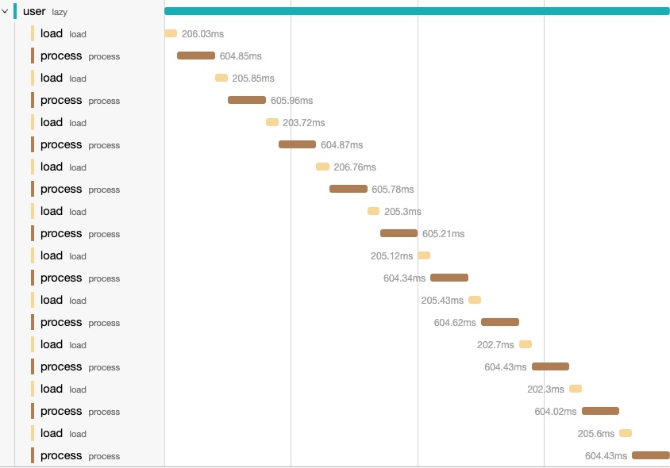
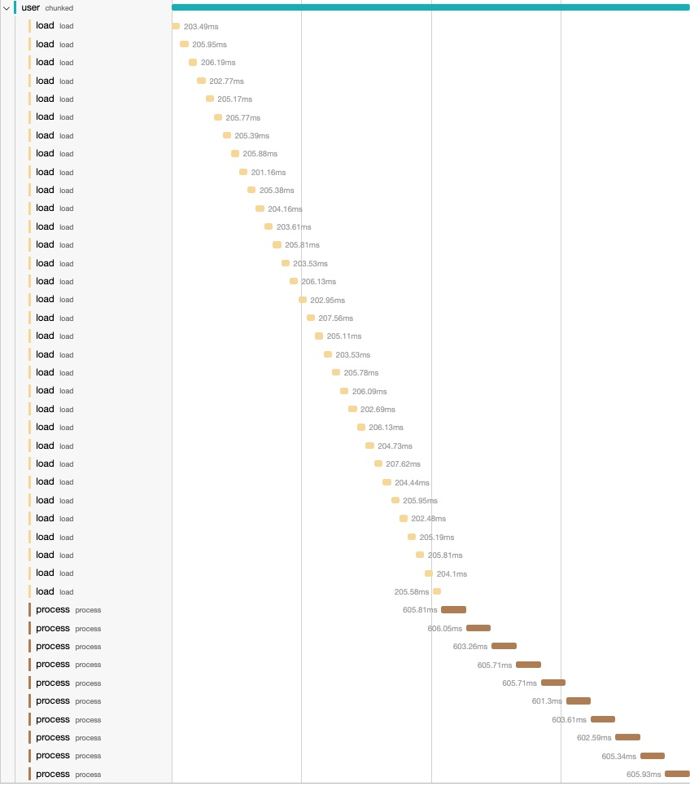
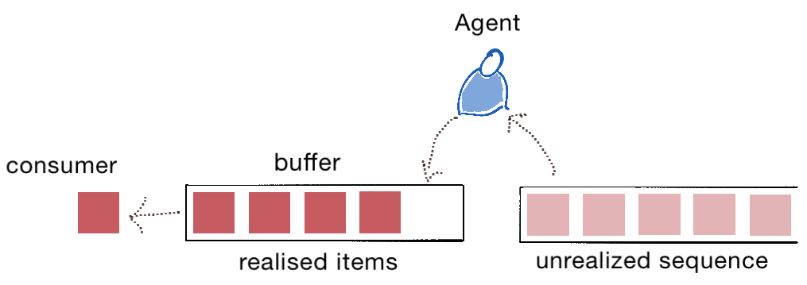
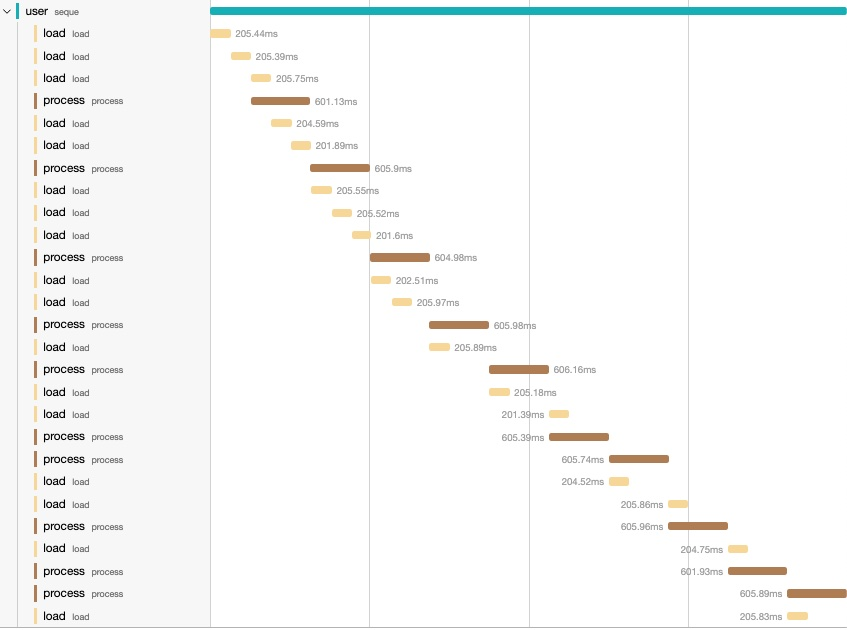
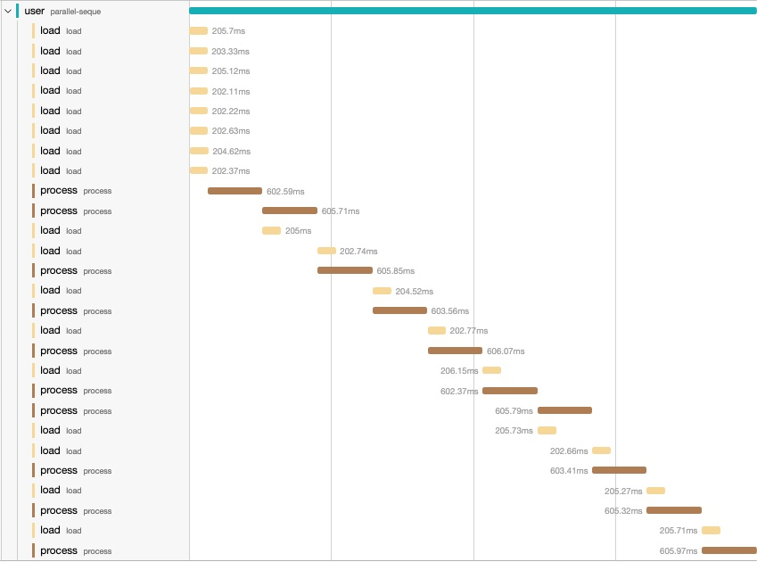
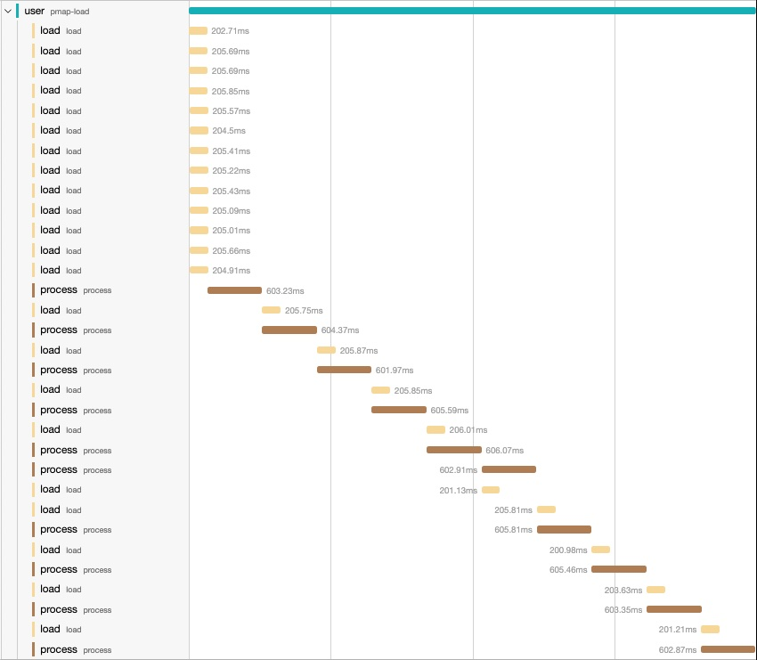

The Clojure core namespace boasts an impressive array of functions, numbering
over 600 by my estimation. Even with many years of Clojure development under my
belt, I still stumble upon hidden treasures. In this post, I'll delve into how
the consumption of various lazy sequences influences computation. Lazy sequences
have been a staple in Clojure since version 1.0, so they're hardly a
novelty. There are distinct types of lazy sequences in Clojure: the "truly" lazy
ones, chunked sequences, and "buffered" sequences. I believe most Clojure
developers will be familiar with at least the first two types. This article
primarily shines a spotlight on the "buffered" sequences (or queued sequences)
and their unique behaviors. Through a series of examples, we'll navigate the
nuances of these sequences and observe their behaviors upon consumption.


## Lazy sequences

In its simplest form, a lazy sequence in Clojure can be constructed using
[`lazy-seq`](https://clojuredocs.org/clojure.core/lazy-seq). `lazy-seq` takes a
body of expressions and it delays the evaluation until it is requested,
similarly to an `iterator` that executes the body only when the `.next()` method
is invoked.  For instance, to create a lazy sequence of all integer numbers we
can write:

```clojure
(defn my-lazy-seq
  ([]
   (my-lazy-seq 0))
  ([n]
   (lazy-seq
     (cons n
       (my-lazy-seq (inc n))))))

(take 10 (my-lazy-seq))
;; => (0 1 2 3 4 5 6 7 8 9)
```

There are many other functions in the Clojure core which
return lazy sequences as well.  For example we could rewrite the previous
function using [`iterate`](https://clojuredocs.org/clojure.core/iterate):

```clojure
(defn my-lazy-seq
  []
  (iterate inc 0))

(take 10 (my-lazy-seq))
;; => (0 1 2 3 4 5 6 7 8 9)
```

The two functions are equivalent. To illustrate the different behaviours let’s
introduce two functions: `load` and `process`. For the sake of the example let’s
assume that `my-lazy-seq` returns the path of files to be processed, or the ids
of some database records to be processed, the function `load` will simulate the
retrieval from the db, and the function `process` represents a function
performing computations on the retrieved data.


```clojure
(defn load
  [v]
  (printf "Loading: %d \n" v) (flush)
  (Thread/sleep 200)
  v)

(defn process
  [v]
  (printf "Processing: %d \n" v) (flush)
  (Thread/sleep 600)
  v)
```

To process the first 10 items of `my-lazy-seq` we could write:

```clojure
(->> (my-lazy-seq)
     (map load)
     (map process)
     (take 10))
```

There are a few things to point out from the above lines:
  1. evaluating this expression won't cause the execution of neither `load` nor
     the `precess` function.
  2. `map` and `take` both return lazy sequences, therefore evaluating the
     expression will only create a chain of lazy sequences which upon
     consumption will cause a chain reaction of `load`/`process` calls.
  3. evaluating the code in a REPL or an IDE will certainly trigger the
     execution of the `load` and `process` functions because the REPL will
     attempt to print the result. The default behaviour of the REPL is to print
     the content of a sequence up to the
     [`*print-length*`](https://clojuredocs.org/clojure.core/*print-length*). It
     is good practice to set a limit into to your REPL configuration. For example:
     `(set! *print-length* 100)` will tell the REPL to only consume and print
     the first 100 items of a sequence. The default value is `nil` which tells
     the REPL to consume it all. Evaluating lazy infinite sequences like `my-lazy-seq`
     on the REPL without `*print-length*` will cause the REPL to hang.
  4. For completeness I will add a `doall` at the end of each evaluation to
     force the lazy sequence to be realized regardless of a specific `*print-length*`
     configuration.


```clojure
(->> (my-lazy-seq)
     (map load)
     (map process)
     (take 10)
     (doall))

;; Loading: 0
;; Processing: 0
;; Loading: 1
;; Processing: 1
;; Loading: 2
;; Processing: 2
;; Loading: 3
;; Processing: 3
;; Loading: 4
;; Processing: 4
;; Loading: 5
;; Processing: 5
;; Loading: 6
;; Processing: 6
;; Loading: 7
;; Processing: 7
;; Loading: 8
;; Processing: 8
;; Loading: 9
;; Processing: 9
;; => (0 1 2 3 4 5 6 7 8 9)
```

That's pretty much what we expected. Every item of the lazy sequence is loaded
first and then processed in a strict succession.

To better visualize what is happening I've instrumented the `load` and `process`
functions with [`μ/trace`](https://github.com/BrunoBonacci/mulog#%CE%BCtrace)
and published the traces into [Jaeger](https://www.jaegertracing.io/).

Looking the above execution this is what I get:



`μ/trace` makes it incredibly easy to visualize the sequence of operations. I
use it all the time to reinforce my mental model of how some operations are
executed in larger applications.


## Chunked sequences

Chunked sequences are an optimisation to reduce the allocation.
A chunked sequence instead of realizing one element at the time,
it will realize a chunk of them (usually 32). From a consumer
point of view, it is almost totally transparent. The prime
example of chunked sequences is the
[`range`](https://clojuredocs.org/clojure.core/range) function.

```clojure
(range 10)
;; => (0 1 2 3 4 5 6 7 8 9)

(chunked-seq? (range 10))
;; => true

(chunked-seq? (my-lazy-seq))
;; => false
```

The chunking effect can be seen when applying a transformation like in our
previous example. If we replace `my-lazy-seq` with `range`, we see something
interesting.

```clojure
;; clean
(->> (range 100)
     (map load)
     (map process)
     (take 10)
     (doall))

;; Loading: 0
;; Loading: 1
;; Loading: 2
;; Loading: 3
;; Loading: 4
;; Loading: 5
;; Loading: 6
;; Loading: 7
;; Loading: 8
;; Loading: 9
;; Loading: 10
;; Loading: 11
;; Loading: 12
;; Loading: 13
;; Loading: 14
;; Loading: 15
;; Loading: 16
;; Loading: 17
;; Loading: 18
;; Loading: 19
;; Loading: 20
;; Loading: 21
;; Loading: 22
;; Loading: 23
;; Loading: 24
;; Loading: 25
;; Loading: 26
;; Loading: 27
;; Loading: 28
;; Loading: 29
;; Loading: 30
;; Loading: 31
;; Processing: 0
;; Processing: 1
;; Processing: 2
;; Processing: 3
;; Processing: 4
;; Processing: 5
;; Processing: 6
;; Processing: 7
;; Processing: 8
;; Processing: 9
;; => (0 1 2 3 4 5 6 7 8 9)
```

Notice that despite the fact we only consumed 10 items from the result, 32 items
were realized from the first sequence and loaded, then `(map load)` returns a
true lazy sequence so only 10 items were `processed`.

```clojure
(chunked-seq? (range 100))
;; => true

(chunked-seq? (map inc (range 100)))
;; => false
```
If we look at the execution trace of our previous example we can see that nicely:



As you attempt to realize the first item, the initial chunk of 32 items is
realized. All these items remain in memory until the chunk is entirely
consumed. Once the consumer requests the 33rd item, a new chunk of 32 items is
realized.

Chunked sequences are beneficial when the cost of realizing each item is
minimal, offering an optimization in terms of allocations.

To create a chunked sequence the Clojure core provides a set of functions:
[`chunk-buffer`](https://clojuredocs.org/clojure.core/chunk-buffer),
[`chunk`](https://clojuredocs.org/clojure.core/chunk),
[`chunk-append`](https://clojuredocs.org/clojure.core/chunk-append),
[`chunk-cons`](https://clojuredocs.org/clojure.core/chunk-cons),
[`chunk-rest`](https://clojuredocs.org/clojure.core/chunk-rest) and
[`chunked-seq?`](https://clojuredocs.org/clojure.core/chunked-seq_q) which we
have already seen.

## Buffered sequences

Buffered sequences share some similarities with chunked sequences, but they
exhibit a slightly different behavior. Their main goal is to minimize the wait
time for consumers by storing a set number of realized items in a buffer (or
queue). Buffered sequences maintain a fixed-length buffer. A Clojure agent works
diligently to ensure the buffer is consistently populated with realized
items. Consequently, when the consumer requires a new item for processing,
multiple items are readily available.



On the right, there's an unrealized lazy sequence. A Clojure agent will try to
fill the buffer as swiftly as possible. The items in the buffer are always in a
realized state. The consumer then retrieves items from the buffer in the same
sequence order (FIFO) for further processing.

The Clojure core to build such sequences is [`seque`](https://clojuredocs.org/clojure.core/seque).

Let's examine how buffered sequences impact computation, using our previous example.

```clojure
(->> (my-lazy-seq)
  (map load)
  (seque 5)    ;; buffer of 5
  (map process)
  (take 10)
  (doall))

;; Loading: 0
;; Loading: 1
;; Loading: 2
;; Processing: 0
;; Loading: 3
;; Loading: 4
;; Processing: 1
;; Loading: 5
;; Loading: 6
;; Loading: 7
;; Processing: 2
;; Loading: 8
;; Loading: 9
;; Processing: 3
;; Loading: 10
;; Processing: 4
;; Loading: 11
;; Processing: 5
;; Loading: 12
;; Processing: 6
;; Loading: 13
;; Loading: 14
;; Processing: 7
;; Processing: 8
;; Loading: 15
;; Loading: 16
;; Processing: 9
;; => (0 1 2 3 4 5 6 7 8 9)
```

From the output, it's evident how the agent works. `Loading:` and `Processing:`
statements are interleaved in a seemingly random order. This is attributable to
the agent operating on a separate thread in the background. By introducing a
buffered sequence between the `load` and `process` we have a sort of
**"pre-fetcher"** which attempts to keep *at most* 5 items always realized
and ready to be processed.  As items are consumed from the buffer the agent
tries to replace them with new items from the unrealized sequence upstream. The
key difference compared to the chunked sequences is that while the chunked
sequences do not realize items until the first item of a chunk is requested,
buffered sequences realize enough items to fill the buffer ahead of the
consumption.



`seque` is an excellent choice when it is important to minimize the wait-time on
consumer side and have items readily available. The important aspect is that it
allows for a configurable size. By carefully selecting the buffer size we
are able to control how many items (potentially big) are realized in memory at
any point in time. `seque` is truly a `clojure.core` hidden gem!

One thing to notice is that `seque` is semi-lazy as it will try to fill the
buffer as soon as it called. We can see this clearly if we define a var without
consuming the sequence.

```clojure
(def processing-seq
  (->> (my-lazy-seq)
    (map load)
    (seque 5) ;; buffer of 5
    (map process)
    (take 10)))
Loading: 0
Loading: 1
Loading: 2
Loading: 3
Loading: 4
Loading: 5
Loading: 6
#'user/processing-seq
```

Even though we created a buffer of 5 items we can see that there are 6 items
realized here. The buffer is backed by a blocking queue. The agent tries to
continuously push new items to the buffer, so when the buffer is full, there is
one more item being consumed from the upstream sequence by the agent who is
blocked on the queue `offer` operation. As soon as an item is consumed, the
`offer` will be accepted and the in-flight item will be inserted into the queue.

## Parallel pre-fetcher

With a small change we can load the items in parallel. That's useful when
the upstream operation (`load` in this case) is dominated by IO.

```clojure
(->> (my-lazy-seq)
     (map (fn [v] (future (load v)))) ;; load in parallel
     (seque 5)     ;; buffer up to 5 items (+1 in-flight)
     (map deref)   ;; deref the future
     (map process)
     (take 10)
     (doall))
;; Loading: 2
;; Loading: 3
;; Loading: 4
;; Loading: 6
;; Loading: 0
;; Loading: 5
;; Loading: 1
;; Loading: 7
;; Processing: 0
;; Processing: 1
;; Loading: 8
;; Processing: 2
;; Loading: 9
;; Processing: 3
;; Loading: 10
;; Processing: 4
;; Loading: 11
;; Processing: 5
;; Loading: 12
;; Processing: 6
;; Loading: 13
;; Processing: 7
;; Loading: 14
;; Processing: 8
;; Loading: 15
;; Processing: 9
;; Loading: 16
;; => (0 1 2 3 4 5 6 7 8 9)
```

With this small change we can fill the buffer faster especially in I/O dominated
operations.



We can easily isolate this pattern and create a `pre-fetch` function:

```clojure
(defn pre-fetch
  "Returns a semi-lazy sequence consisting of the result of applying
   `f` to items of `coll`. It is semi-lazy as it will attempt to keep
   always `n` items in a buffer + 1 item in flight.
   Useful to minimize the waiting time of a consumer."
  [n f coll]
  (->> coll
    (map (fn [i] (future (f i))))
    (seque n)
    (map deref)))
```

and then use it as:

```clojure
(->> (my-lazy-seq)
  (pre-fetch 5 load)
  (map process)
  (take 10)
  (doall))
```

## What about `pmap`?

[`pmap`](https://clojuredocs.org/clojure.core/pmap) has a similar behaviour but
you can't control how many items are realized. It depends on the number of CPU
cores in available in the runtime machine.
`pmap` always uses [`(+ 2 (.. Runtime getRuntime availableProcessors))`](https://github.com/clojure/clojure/blob/clojure-1.10.1/src/clj/clojure/core.clj#L7021C12-L7021C61) threads.


```clojure
(->> (my-lazy-seq)
  (pmap load)
  (map process)
  (take 10)
  (doall))

;; Loading: 0
;; Loading: 1
;; Loading: 2
;; Loading: 4
;; Loading: 8
;; Loading: 3
;; Loading: 9
;; Loading: 7
;; Loading: 6
;; Loading: 5
;; Loading: 12
;; Loading: 11
;; Loading: 10
;; Processing: 0
;; Processing: 1
;; Loading: 13
;; Loading: 14
;; Processing: 2
;; Processing: 3
;; Loading: 15
;; Processing: 4
;; Loading: 16
;; Processing: 5
;; Loading: 17
;; Processing: 6
;; Loading: 18
;; Processing: 7
;; Loading: 19
;; Processing: 8
;; Loading: 20
;; Processing: 9
;; Loading: 21
;; => (0 1 2 3 4 5 6 7 8 9)
```

My laptop has 10 CPU cores so the `load` ran on 12 items.




## Conclusions

Throughout this post, we've delved into various types of lazy sequences and
examined their influence on the execution of mapping functions. We explored
three distinct categories of lazy sequences:

1. The "truly" lazy sequences, which realize items individually as they are requested.
2. The chunked sequences, which process multiple items simultaneously.
3. The buffered sequences, which consistently maintain a reservoir of realized items, ready for consumption.

The salient distinction between chunked and buffered sequences lies in their
approach to realization. While chunked sequences await a consumer's request for
an item, buffered sequences take a proactive stance, anticipating the need and
realizing a batch of items from the preceding sequence.

Each of these types occupies its unique niche and finds relevance in various
applications. It rests upon us, the developers, to judiciously select the most
fitting type tailored to the specific challenges we encounter.
