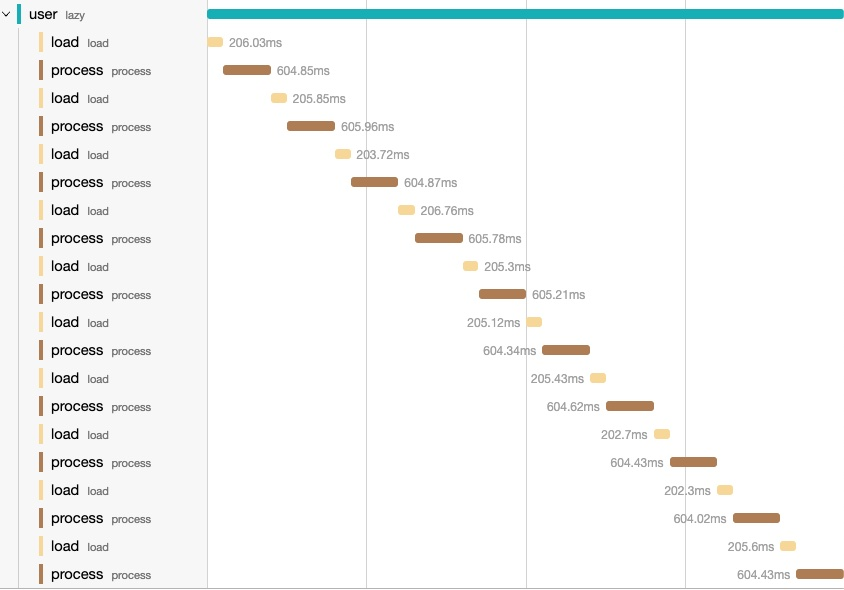
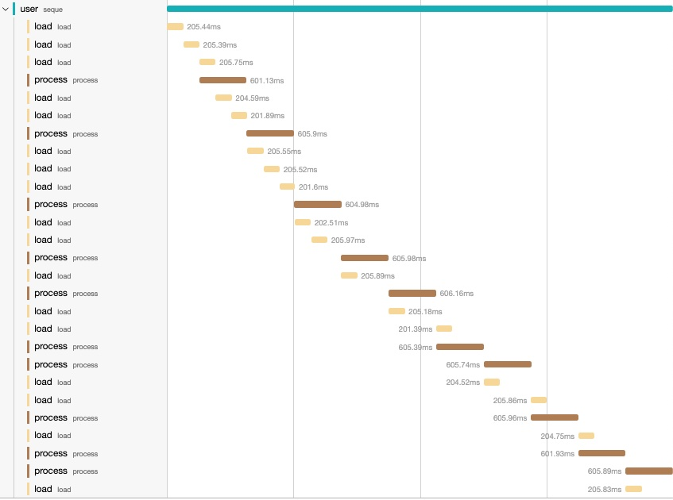
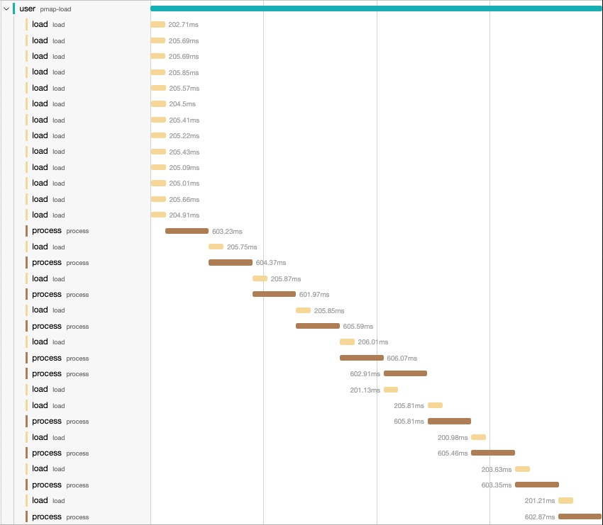

The Clojure core namespace has an impressive number of functions, over 600 (to
my eyeballing count). Even after many years of Clojure development, I still get
to discover hidden gems. In this post I will show the different type of lazy
sequences and how consuming a lazy sequence affects the computation. Lazy
sequences in Clojure have been around since 1.0, so certainly they are not a new
thing. In Clojure there are different types of lazy sequences: the “truly” lazy
ones, the chunked sequences and the “buffered” sequences. I’m sure every Clojure
developer will be familiar with at least the first two types. This post is
really about the “buffered” sequences (or queued sequences) and their
behaviour. With the help of some examples, in this post we will explore the
different types and see how they behave when we consume them.

## Lazy sequences

To construct a lazy sequence in Clojure in its simplest form we can to use
[`lazy-seq`](https://clojuredocs.org/clojure.core/lazy-seq). `lazy-seq` takes a
body of expressions and it delays the evaluation until it is requested,
similarly to an `iterator` that executes the body only when the `.next` method
is called.  For example, to create a lazy sequence of all the integers number we
can write:

```clojure
(defn my-lazy-seq
  ([]
   (my-lazy-seq 0))
  ([n]
   (lazy-seq
     (cons n
       (my-lazy-seq (inc n))))))

(take 10 (my-lazy-seq))
;; => (0 1 2 3 4 5 6 7 8 9)
```

There are many other functions in the Clojure core which
return lazy sequences as well.  For example we could rewrite the previous
function using iterate:

```clojure
(defn my-lazy-seq
  []
  (iterate inc 0))

(take 10 (my-lazy-seq))
;; => (0 1 2 3 4 5 6 7 8 9)
```

The two functions are equivalent. To illustrate the different behaviours let’s
introduce two functions: `load` and `process`. For the sake of the example let’s
assume that `my-lazy-seq` returns the path of files to be processed, or the ids
of some database records to be processed, the function `load` will simulate the
retrieval from the db, and the function `process` will simulate a function which
perform a computation on the loaded value.

```clojure
(defn load
  [v]
  (printf "Loading: %d \n" v) (flush)
  (Thread/sleep 200)
  v)

(defn process
  [v]
  (printf "Processing: %d \n" v) (flush)
  (Thread/sleep 600)
  v)
```

If we want to process the first 10 items of `my-lazy-seq` then we could write as
follow:

```clojure
(->> (my-lazy-seq)
     (map load)
     (map process)
     (take 10))
```

There are a few things to point out from the above lines:
  1. evaluating this expression won't cause the execution of neither `load` nor
     the `precess` function.
  2. `map` and `take` both return lazy sequences, therefore evaluating the
     expression will only create a chain of lazy sequences which upon
     consumption will cause a chain reaction of `load`/`process` calls.
  3. evaluating the code in a REPL or an IDE will certainly trigger the
     execution of the `load` and `process` functions because the REPL will
     attempt to print the result. The default behaviour of the REPL is to print
     the content of a sequence up to the
     [`*print-length*`](https://clojuredocs.org/clojure.core/*print-length*). It
     is good practice to add this to your REPL configuration. For example:
     `(set! *print-length* 100)` will tell the REPL to only consume and print
     the first 100 items of a sequence. The default value is `nil` will tells
     the REPL to consume it all. Evaluating lazy infinite sequences like `my-lazy-seq`
     on the REPL without `*print-length*` will cause the REPL to hang.
  4. For completeness I will add a `doall` at the end of each evaluation to
     force the lazy sequence to be realized.


```clojure
(->> (my-lazy-seq)
     (map load)
     (map process)
     (take 10)
     (doall))

;; Loading: 0
;; Processing: 0
;; Loading: 1
;; Processing: 1
;; Loading: 2
;; Processing: 2
;; Loading: 3
;; Processing: 3
;; Loading: 4
;; Processing: 4
;; Loading: 5
;; Processing: 5
;; Loading: 6
;; Processing: 6
;; Loading: 7
;; Processing: 7
;; Loading: 8
;; Processing: 8
;; Loading: 9
;; Processing: 9
;; => (0 1 2 3 4 5 6 7 8 9)
```

That's pretty much what we expected, every item of the lazy sequence is loaded
first and then processed in a strict succession.

To better visualize what is happening I've instrumented the `load` and `process`
functions with [`μ/trace`](https://github.com/BrunoBonacci/mulog#%CE%BCtrace)
and published the traces into [Jaeger](https://www.jaegertracing.io/).

Looking the above execution this is what I get:



`μ/trace` makes it incredibly easy to visualize the sequence of operations. I
use it all the time to reinforce my mental model of how some operations are
executed in larger applications.


## Chunked sequences

Chunked sequences are an optimisation to reduce the allocation.
A chunked sequence instead of realizing one element at the time,
it will realize a chunk of them (usually 32). From a consumer
point of view it is almost totally transparent. The prime
example of chunked sequences is the
[`range`](https://clojuredocs.org/clojure.core/range) function.

```clojure
(range 10)
;; => (0 1 2 3 4 5 6 7 8 9)

(chunked-seq? (range 10))
;; => true

(chunked-seq? (my-lazy-seq))
;; => false
```

The chunking effect can be seen when applying a transformation like in our
previous example. If we replace `my-lazy-seq` with `range` this is what we see
something interesting.

```clojure
;; clean
(->> (range 100)
     (map load)
     (map process)
     (take 10)
     (doall))

;; Loading: 0
;; Loading: 1
;; Loading: 2
;; Loading: 3
;; Loading: 4
;; Loading: 5
;; Loading: 6
;; Loading: 7
;; Loading: 8
;; Loading: 9
;; Loading: 10
;; Loading: 11
;; Loading: 12
;; Loading: 13
;; Loading: 14
;; Loading: 15
;; Loading: 16
;; Loading: 17
;; Loading: 18
;; Loading: 19
;; Loading: 20
;; Loading: 21
;; Loading: 22
;; Loading: 23
;; Loading: 24
;; Loading: 25
;; Loading: 26
;; Loading: 27
;; Loading: 28
;; Loading: 29
;; Loading: 30
;; Loading: 31
;; Processing: 0
;; Processing: 1
;; Processing: 2
;; Processing: 3
;; Processing: 4
;; Processing: 5
;; Processing: 6
;; Processing: 7
;; Processing: 8
;; Processing: 9
;; => (0 1 2 3 4 5 6 7 8 9)
```

Notice that despite the fact we only consumed 10 items from the result, 32 items
were realized from the first sequence and loaded, then `(map load)` returns a
true lazy sequence so only 10 items were `processed`.

```clojure
(chunked-seq? (range 100))
;; => true

(chunked-seq? (map inc (range 100)))
;; => false
```
If we look at the execution trace of our previous example we can see that nicely:


You can see that as you try realize first item, the first chunk of 32 is
realized then all the realized items are kept in memory until the chunk is fully
consumed, finally once the consumer asks for the the 33rd item a new chunk of 32
items is realized.

Chunked sequences are useful when the cost of realizing each item is small thus
providing an optimisation in terms off allocations.

To create a chunked sequence the Clojure core provides a set of functions:
[`chunk-buffer`](https://clojuredocs.org/clojure.core/chunk-buffer),
[`chunk`](https://clojuredocs.org/clojure.core/chunk),
[`chunk-append`](https://clojuredocs.org/clojure.core/chunk-append),
[`chunk-cons`](https://clojuredocs.org/clojure.core/chunk-cons),
[`chunk-rest`](https://clojuredocs.org/clojure.core/chunk-rest) and
[`chunked-seq?`](https://clojuredocs.org/clojure.core/chunked-seq_q) which we
have already seen.

## Buffered sequences

Buffered sequences have some similarity with the chunked sequences but their
behaviour is slightly different. Their objective is to minimize the consumer
wait time by storing a number of realized items in a buffer (queue).  Buffered
sequences have a fix length buffer. A Clojure agent tries its best to keep the
buffer always full of realized items, when the consumer needs a new item to
process there is a bunch of them already available.


On the right-hand side there is an unrealized lazy sequence. A Clojure agent
will attempt to fill the buffer as fast as it can. The items in the buffer are
always realized. Then the consumer will fetch items from the buffer in the same
order as they were in the sequence (fifo) to continue the processing.

the Clojure core which builds such sequences is [`seque`](https://clojuredocs.org/clojure.core/seque).

Let's see in our previous example how buffered sequences will affect the
computation.

```clojure
(->> (my-lazy-seq)
  (map load)
  (seque 5)    ;; buffer of 5
  (map process)
  (take 10)
  (doall))

;; Loading: 0
;; Loading: 1
;; Loading: 2
;; Processing: 0
;; Loading: 3
;; Loading: 4
;; Processing: 1
;; Loading: 5
;; Loading: 6
;; Loading: 7
;; Processing: 2
;; Loading: 8
;; Loading: 9
;; Processing: 3
;; Loading: 10
;; Processing: 4
;; Loading: 11
;; Processing: 5
;; Loading: 12
;; Processing: 6
;; Loading: 13
;; Loading: 14
;; Processing: 7
;; Processing: 8
;; Loading: 15
;; Loading: 16
;; Processing: 9
;; => (0 1 2 3 4 5 6 7 8 9)
```

From the output, you can see the agent at work. `Loading:` and `Processing:`
statements are interleaved in a seemingly random order. That's because the agent
in the background is running on a different thread.  By introducing a buffered
sequence between the `load` and `process` we have a sort of **"pre-fetcher"**
which will attempt to keep *at most* 5 items always realized and ready to be
processed.  As items are consumed from the buffer the agent tries to replace
them with new items from the unrealized sequence upstream. The key difference
compared to the chunked sequences is that while the chunked sequences do not
realize items until the first item of a chunk is requested, buffered sequences
realize enough items to fill the buffer ahead of the consumption.



`seque` is an excellent choice when it is important to minimize the wait on
consumer side and have items readily available. The important aspect is that it
allows for a configurable size. By carefully selecting the buffer size we
are able to control how many items (potentially big) are realized in memory at
any point in time. `seque` is truly a `clojure.core` hidden gem!

One thing to notice is that `seque` is semi-lazy as it will try to fill the
buffer as soon as it called. We can see this clearly if we define a var without
consuming the sequence.

```clojure
(def processing-seq
  (->> (my-lazy-seq)
    (map load)
    (seque 5) ;; buffer of 5
    (map process)
    (take 10)))
Loading: 0
Loading: 1
Loading: 2
Loading: 3
Loading: 4
Loading: 5
Loading: 6
#'user/processing-seq
```

Even though we created a buffer of 5 items we can see that there are 6 items
realized here. The buffer is backed by a blocking queue. The agent tries to
continuously push new items to the buffer, so when the buffer is full, there is
one more item being consumed from the upstream sequence by the agent who is
blocked on a queue `offer` operation. As soon as an item is consumed, the
offer will be accepted and the in-flight item will be inserted into the queue.

## Parallel pre-fetcher

With a small modification we can load the items in parallel. That's useful when
the upstream operation (`load` in this case) is dominated by IO.

```clojure
(->> (my-lazy-seq)
     (map (fn [v] (future (load v)))) ;; load in parallel
     (seque 5)     ;; buffer up to 5 items (+1 in-flight)
     (map deref)   ;; deref the future
     (map process)
     (take 10)
     (doall))
;; Loading: 2
;; Loading: 3
;; Loading: 4
;; Loading: 6
;; Loading: 0
;; Loading: 5
;; Loading: 1
;; Loading: 7
;; Processing: 0
;; Processing: 1
;; Loading: 8
;; Processing: 2
;; Loading: 9
;; Processing: 3
;; Loading: 10
;; Processing: 4
;; Loading: 11
;; Processing: 5
;; Loading: 12
;; Processing: 6
;; Loading: 13
;; Processing: 7
;; Loading: 14
;; Processing: 8
;; Loading: 15
;; Processing: 9
;; Loading: 16
;; => (0 1 2 3 4 5 6 7 8 9)
```

With this small change we can fill the buffer faster especially in I/O dominated
operations.


We can easily isolate this pattern and create a `pre-fetch` function:

```clojure
(defn pre-fetch
  "Returns a semi-lazy sequence consisting of the result of applying
   `f` to items of `coll`. It is semi-lazy as it will attempt to keep
   always `n` items in a buffer + 1 item in flight.
   Useful to minimize the waiting time of a consumer."
  [n f coll]
  (->> coll
    (map (fn [i] (future (f i))))
    (seque n)
    (map deref)))
```

and then use it as:

```clojure
(->> (my-lazy-seq)
  (pre-fetch 5 load)
  (map process)
  (take 10)
  (doall))
```

## What about `pmap`?

[`pmap`](https://clojuredocs.org/clojure.core/pmap) has a similar behaviour but
you can't control how many items are realized. It depends on the number of CPU
cores in available in the runtime machine.
`pmap` always uses [`(+ 2 (.. Runtime getRuntime availableProcessors))`](https://github.com/clojure/clojure/blob/clojure-1.10.1/src/clj/clojure/core.clj#L7021C12-L7021C61) threads.


```clojure
(->> (my-lazy-seq)
  (pmap load)
  (map process)
  (take 10)
  (doall))

;; Loading: 0
;; Loading: 1
;; Loading: 2
;; Loading: 4
;; Loading: 8
;; Loading: 3
;; Loading: 9
;; Loading: 7
;; Loading: 6
;; Loading: 5
;; Loading: 12
;; Loading: 11
;; Loading: 10
;; Processing: 0
;; Processing: 1
;; Loading: 13
;; Loading: 14
;; Processing: 2
;; Processing: 3
;; Loading: 15
;; Processing: 4
;; Loading: 16
;; Processing: 5
;; Loading: 17
;; Processing: 6
;; Loading: 18
;; Processing: 7
;; Loading: 19
;; Processing: 8
;; Loading: 20
;; Processing: 9
;; Loading: 21
;; => (0 1 2 3 4 5 6 7 8 9)
```

My laptop has 10 CPU cores so the `load` ran on 12 items.




## Conclusions

In this post we have looked at the different types of lazy sequences and how
they affect the execution of mapping functions.  We looked at three different
types of lazy sequences: the "truly" lazy which realize one item at the time,
the chunked sequences which realize a number of items at once, and the buffered
sequeces which try keep a buffer of realized items always available for
consumption. The key difference between the chunked sequences and the buffered
sequences is that buffered sequences do not wait for the consumer to ask for an
item, they preemptively realize a number of items from the upstream sequence.

All the different types have their place and their use in an applications, it is
up to us to use the best type for solving the problem we have at hand.
