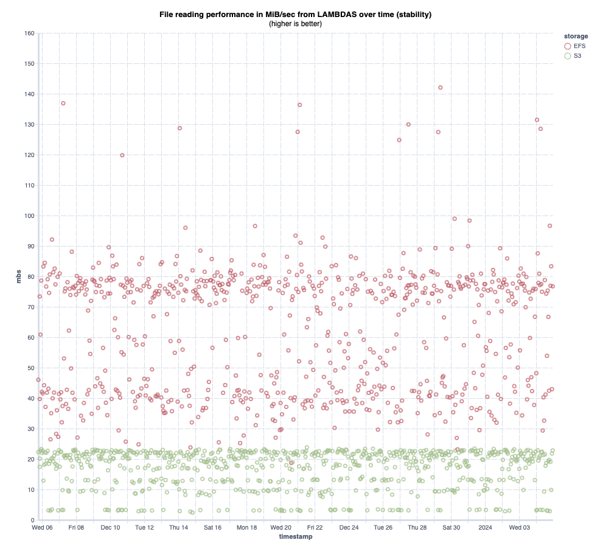

In the dynamic world of cloud computing, serverless architectures like AWS
Lambda and Fargate ECS are celebrated for their scalability and efficiency.
Yet, beneath their convenient abstractions, lie complexities that can impact
performance in ways not immediately apparent. This is particularly true for
network-bound operations, where the unpredictability of underlying hardware can
introduce significant 'jitter' or variability in performance.

For developers and IT professionals navigating this terrain, understanding these
nuances is crucial. Our investigation zeroes in on this very aspect - the extent
of jitter in AWS's serverless environments, focusing on the cold startup
performance of AWS EFS and S3 within AWS Lambda and Fargate ECS rather than the
peak performances.

AWS services, known for their robustness and versatility, show a contrasting
behaviour in our tests. EFS, especially, displayed a startlingly high level of
jitter, with up to a 13x difference in network transfer speed, while S3
maintained a relative consistency. This finding is pivotal, suggesting that
serverless solutions might not be the panacea they are often thought to be,
especially for network-intensive tasks.

In this blog post, we delve into an empirical exploration of these performance
variations. Our objective is not just to highlight the existence of potential
jitter in AWS Lambda and AWS ECS during cold starts, but to quantitatively
measure and analyze its impact. Whether you're a seasoned AWS user or new to
cloud computing, this exploration into the less-travelled paths of serverless
performance will offer valuable perspectives.

# Background: Understanding AWS Services

## AWS S3 and EFS
Amazon S3 (Simple Storage Service) is a highly scalable, secure, and durable
object storage service, widely used for a variety of storage solutions, from
backup and recovery to data lakes. AWS Elastic File System (EFS) provides a
simple, scalable, elastic file storage system for use with AWS Cloud services
and on-premises resources. It's designed to provide massively parallel shared
access to thousands of Amazon EC2 instances.

## AWS Lambda and Fargate ECS
AWS Lambda is a serverless computing service that lets you run code without
provisioning or managing servers. It automatically scales your application by
running code in response to each trigger. AWS Fargate ECS (Elastic Container Service)
is a serverless compute engine for containers. Fargate removes the need to
provision and manage servers, letting you specify and pay for resources per
application.

# The Genesis of Our Investigation

Our journey into this deep dive began with a curious observation in our AWS
environment. While scaling our ECS tasks during periods of intensive load, we
encountered an intriguing pattern: newly created tasks demonstrated extremely
variable performances, particularly in their interactions with AWS Elastic File
System (EFS). This inconsistency wasn't just a minor fluctuation; it was stark,
raising questions about the underlying network performance and stability in a
serverless architecture.

This variability was not merely a technical anomaly but a potential red flag for
any environment relying on consistent performance for optimal operation. In a
landscape where milliseconds can impact user experience and efficiency, such
fluctuations needed a thorough examination. We knew this was more than a one-off
issue — it was a window into the often opaque world of serverless computing
performance.

Driven by a need to understand and quantify this variability, we embarked on a
comprehensive benchmarking study. Our goal was clear: to explore, measure, and
analyze the network performance of AWS serverless services, particularly Lambda
and Fargate ECS, in their interaction with EFS and S3. This was not just about
satisfying technical curiosity; it was about gaining insights crucial for anyone
architecting, deploying, and scaling applications in AWS's serverless ecosystem.

## Why It Matters
In serverless architectures, understanding network performance is crucial. It
affects everything from application responsiveness to operational costs. In
environments where resources are abstractly managed, issues like network jitter
can introduce significant challenges, often unnoticed until they impact critical
operations.

# Test Setup and Methodology

## Environment Setup
Our tests were carried out in a well-configured AWS environment.

For this test we used the `eu-west-1`/Ireland region. Services are running
in a purpose built VPC network.

Lambda Setup:
- AWS Lambda with 10GB of memory
- custom runtime based on Amazon Linux 2023
- ARM64 architecture
- Isolated custom VPC

Fargate Setup:
- AWS Fargate ECS with 8 vCPUs and 32GB memory
- ARM64 architecture
- The container is based on Amazon Linux 2023 and uses the same binary as AWS
  Lambda, ensuring consistency across both services.
- Isolated custom VPC

S3 config:
- VPC endpoint

EFS setup:
- Performance mode: General Purpose
- Throughput mode: Elastic
- Encryption enabled
- VPC endpoint

We prepared an array of files of varying sizes for our tests, located on both S3
and EFS. These included files ranging from 1MiB to 1000MiB. This range was
crucial to examine throughput under different data loads.

Our testing involved a specific application designed to randomly select one of
these files and then measure the download throughput. This approach allowed us
to gather comprehensive data on the transfer rates. We ensured all the performance
metrics were accurately logged into AWS Cloudwatch for analysis. The test ran
multiple times during the day for a month.

We set up the test in such a way that the execution would most likely be from a
cold start in order to minimize the effects of caches.

## Benchmarking Process
To ensure a comprehensive evaluation of network performance in serverless AWS
environments, our benchmarking process was designed with a focus on precision
and relevance.

### Process Overview:
1. **File Selection:** Our application, running both on AWS Lambda and Fargate
  ECS, was programmed to randomly select one file from our predefined set of
  different sizes (ranging from 1MiB to 1000MiB) on S3 and EFS. This random
  selection was to simulate a variety of real-world scenarios, ensuring our
  results covered a broad spectrum of use cases.
2. **Throughput Measurement:** Once a file was selected, the application
  proceeded to download it completely. The core metric we focused on was the
  throughput, specifically measuring the speed of downloading all the bytes of
  the file. This approach provided us with a direct measure of network
  performance, giving us realistic speeds achievable in these serverless
  environments on a cold start. The measurement only covered the transfer time
  on the network and not the function/container initialization.
3. **Data Logging:** To capture and analyze the data accurately, every test
  result – including the file size, the time taken to download, and the
  throughput – was automatically logged into AWS Cloudwatch. This allowed us to
  gather a large dataset for a thorough analysis.
4. **Repetition for Reliability:** Recognizing the importance of reliability in
  our findings, we repeated this process multiple times across various times of
  the day for a month and under different load conditions. This repetition helped
  in mitigating anomalies and capturing a more consistent picture of the network
  performance.
5. **Cold Start Analysis:** A key aspect of our testing was understanding the
  impact of cold starts. By initiating tests from a cold start state, we were
  able to capture the initial performance characteristics, which are critical in
  understanding the real-world behaviour of these services.
6. **Comparative Analysis:** Lastly, by running these tests in both AWS Lambda
  and Fargate ECS environments, we were able to draw direct comparisons between
  the two, offering insights into the performance nuances unique to each service.

### End Goal:
The ultimate goal of our benchmarking was to understand the real-world network
performance of AWS Lambda and Fargate ECS, particularly during cold starts.
Rather than seeking peak throughput, our focus was on realistic performance
scenarios — what developers and IT professionals are likely to experience in
daily operations. This approach was designed to provide a practical understanding
of these services’ reliability and consistency under varying conditions. It's
about setting realistic expectations for throughput during the critical initial
response times in serverless computing, which is crucial for application planning
and architecture decisions.

# Unveiling the Results

## S3 vs EFS

Our month-long study generated a wealth of data, revealing striking differences
in read performance between AWS S3 and EFS, when accessed from a cold-start AWS
Lambda function. The results are illustrated in a scatterplot graph, where file
sizes are plotted on the X-axis against the read throughput (measured in MiB/s)
on the Y-axis. Overlaying this scatterplot is a line representing the mean read
throughput, with a 95% confidence interval, giving us a clear visual
representation of the average performance and its variability.

Key Observations:
- **EFS Variability:** The most noticeable observation is the considerable
  variability in EFS's performance. Unlike the relatively stable throughput of
  S3, EFS displayed a wide range in throughput rates, particularly noticeable
  when reading smaller files (≤ 1MiB).
- **Bi-Modal Nature of EFS:** Interestingly, the EFS performance exhibited a
  bi-modal distribution. This pattern indicates two distinct 'modes' of operation
  or performance levels, which could be an artifact of underlying infrastructure
  or configuration differences within the AWS environment.
- **S3's Increasing Throughput:** In contrast, S3 demonstrated a more predictable
  behaviour. Our data showed a clear trend: as the file size increased, so did
  the S3 throughput. This consistency is a crucial factor for applications where
  predictability in performance is as important as the performance itself.
- **Comparative Speed:** When directly compared, the read throughput from Lambda
  for EFS was, on average, three times faster than that for S3. However, this
  increased speed comes with the trade-off of higher variability and less
  predictability in performance.

Extending our analysis, we turn our attention to the performance dynamics when
reading from a cold-start Fargate ECS task. The plot, similar in structure to
our previous Lambda analysis, reveals some stark contrasts in read performance,
especially concerning EFS.

Key Observations:
- **Heightened EFS Instability:** In the Fargate ECS environment, EFS read
  throughput displayed even greater instability than observed with Lambda. This
  performance exhibited a pronounced bi-modal distribution, similar to the
  previous example.
- **Extreme Jitter in EFS Performance:** The variability in EFS read times was
  striking. For instance, reading a 500 MiB file fluctuated drastically, taking
  anywhere from as little as 1.1 seconds to as long as 15.8 seconds.
- **Comparative Delays:** On average, we observed that reading the same file in
  Fargate ECS could be up to 9.47 times slower compared to our baseline
  measurements, with extreme cases showing a slowdown of up to 13.8 times.

## Lambda vs Fargate ECS
The following plots compare how AWS Lambda and Fargate ECS each performed in
reading from S3 in a cold-start scenario.

The first plot illustrates the throughput variations when reading files from S3
in both Lambda and Fargate ECS environments. You can see a trend as the file size
increases, so does the throughput, with performance starting to level off after
reaching the 300 MiB mark. What stands out is the predictability of S3’s
performance.

The above plot focuses on EFS performance, comparing file read operations from
Lambda and Fargate ECS. The results are intriguing. While average performances
are similar between the two environments, Fargate ECS occasionally offers
superior performance. However, this boost in performance seems to depend largely
on luck, given the lack of control users have over the underlying infrastructure
beyond container size.

## Comparative Insights
The next two charts are a scatter plot of the read performance over time.

These findings paint a picture of AWS's serverless storage options. While EFS
offers faster read speeds on average, its performance variability, especially
with smaller files, could be a limiting factor for certain applications. On the
other hand, S3's more stable and predictable throughput, albeit slower, might
be more suitable for scenarios where consistency is paramount.

# Conclusion
The results of this experiment were extremely surprising, although we had
suspected some level of variability we didn’t expect so much jitter going into
this. We were not expecting to see such a variance of performance from EFS.
These findings highlight that while serverless architectures offer many
advantages, they also come with their own set of challenges, particularly in
network-bound operations.

In scenarios where applications are network-intensive, especially during cold
startups, serverless might not be the optimal choice. This is crucial for
applications requiring consistent network performance. However, it’s important
to note that serverless solutions do excel in scenarios where the primary
demands are CPU and memory-bound. In these cases, the scalability and efficiency
of serverless computing can be fully leveraged to great effect.

Feel free to [download](/data/serverless-perf/ecs-lambda-read-perf.ndjson) the
data gathered during this expirement and run your own analysis.
